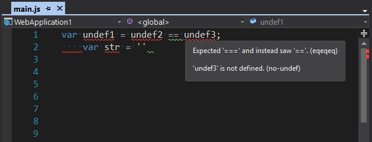
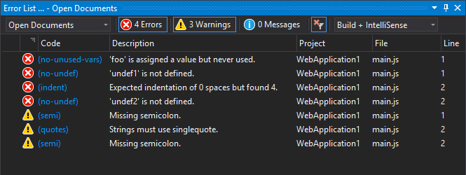

# VisualLinter

[](https://ci.appveyor.com/project/jwldnr/visuallinter)

Visual Studio JavaScript linter using `ESLint`.

Download this extension from the [VS Gallery](https://marketplace.visualstudio.com/vsgallery/a71a5b0d-9f75-4cd2-b1f1-c4afb79a0638)
or get the [CI build](http://vsixgallery.com/extension/21d9f99b-ec42-4df4-8b16-2a62db5392a5/).

---------------------------------------

See the [change log](CHANGELOG.md) for changes and road map.

## Table of Contents

- [Features](#features)
- [Getting Started](#getting-started)
- [Troubleshooting](#troubleshooting)
- [Contribute](#contribute)
- [Inspiration](#inspiration)

## Features

- Lint files using `ESLint` on file open/save
- Visually mark errors/warnings in open document
- Include tooltip content with info on errors/warnings



- Fully integrated with Visual Studio error list



## Getting Started

##### Requirements

- `ESLint` installed locally (per project) _or_ globally (`ESLint` added to `PATH`)
- A valid `ESLint` config located in the current project directory (local) _or_ your user home directory (`~/.eslintrc`, global)

##### Notes

The default behavior was changed to use a local `ESLint` installation and config instead of global. If you wish to revert back to the old behavior of using global installation and/or config, you can enable each respective option in Visual Studio `Tools` > `Options` > `VisualLinter`.

The closest installation/config found relative to the file being linted will always be used.
If no `node_modules` directory or `.eslintrc` file is found in the same directory as the file being linted, `VisualLinter` will try and resolve the paths from ancestor directories up to, but not including the root directory (e.g. `C:\\` on Windows).

For instance, suppose you have the following structure:

```
your-project
├── .eslintrc
├── lib
│ └── source.js
└─┬ tests
  ├── .eslintrc
  └── test.js
```

When `source.js` is being opened or saved the `.eslintrc` file at the root of the project will be used as its config.

When `test.js` is being opened or saved the `.eslintrc` file in the `tests/` directory will be used as its config.

If there are multiple config files in the same directory, `VisualLinter` will only use one. The priority order is:

1. `.eslintrc.js`
2. `.eslintrc.yaml`
3. `.eslintrc.yml`
4. `.eslintrc.json`
5. `.eslintrc`

Currently, `VisualLinter` does NOT support the use of `package.json` as its config file.

Please note that additional `ESLint` plugins may be required in order to lint files depending on your `ESLint` config.
The output window will help identify these plugins, if any.

## Troubleshooting

- If you're using a global installation of `ESLint` and receive an error saying that `ESLint` could not be found in `PATH`, restarting your computer would reload the environment variables.
- If you receive a message saying that `ESLint` could not verify your config, refer to the docs on [how to configure `ESLint`](http://`ESLint`.org/docs/user-guide/configuring)
- Visual Studio 2017 has built in `ESLint` support but does not visually mark errors in buffer. If you're seeing duplicate messages in the error list window, you can disable the built in features by changing the following options:

| Option | Value | Location |
| --- | --- | ---- |
| `Enable ESLint` | `false` | `Options` > `Text Editor` > `JavaScript/TypeScript` > `ESLint` |
| `Enable JavaScript errors` | `false` | `Options` > `Text Editor` > `JavaScript/TypeScript` > `Code Validation` |

Please note that `VisualLinter` is a direct replacement for both options.

## Contribute
[See all contributors on GitHub.](https://github.com/jwldnr/VisualLinter/graphs/contributors)

Check out the [contribution guidelines](CONTRIBUTING.md)
if you want to contribute to this project.

For cloning and building this project yourself, make sure to install the [Extensibility Tools 2015](https://visualstudiogallery.msdn.microsoft.com/ab39a092-1343-46e2-b0f1-6a3f91155aa6) extension for Visual Studio which enables some features used by this project.

## Inspiration

- [SonarSource/SonarLint](https://github.com/SonarSource/sonarlint-visualstudio) extension for Visual Studio.
- [AtomLinter/linter-eslint](https://github.com/AtomLinter/linter-eslint/) `ESLint` package for the Atom text editor.

## License
[MIT](LICENSE)